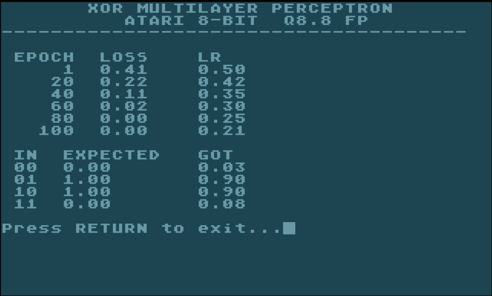

# Multi-Layer Perceptron for Atari 8-bit

A 2-4-1 Multi-Layer Perceptron (MLP) trained to learn the XOR boolean function,
ported to C for the CC65 cross-compiler and compiled to run on Atari 8-bit computers.

## Overview

XORTRAN is a classic neural network demonstration: a small feedforward network that
learns the XOR (exclusive OR) logic gate. This problem was historically significant
because a single perceptron cannot solve it, requiring a multi-layer architecture
with non-linear activation functions.

The original implementation was written in Fortran (XORTRAN.FOR). This repository
contains a C port compiled for the Atari 8-bit family (MOS 6502 processor) using
the CC65 toolchain, producing a loadable `.xex` executable.

## Credits

This code is a port of the XORTRAN PDP-11 Fortran source from: https://github.com/dbrll/Xortran

Credit to Damien Boureille for the original PDP-11 Fortran source (XORTRAN.FOR) which is included in this repo for reference.

## Network Architecture

```
Input Layer (2 neurons)
       |
       v
Hidden Layer (4 neurons, Leaky ReLU activation)
       |
       v
Output Layer (1 neuron, Leaky ReLU activation)
```

- **Input:** 2 binary features (XOR input pair)
- **Hidden:** 4 neurons with Leaky ReLU activation (alpha = 0.01)
- **Output:** 1 neuron with Leaky ReLU activation (binary classification)
- **Loss:** Mean Squared Error (MSE)
- **Optimizer:** Batch gradient descent (full-batch, all 4 samples per epoch)
- **Learning rate:** Starts at 0.5, decays by 0.85 every 20 epochs

## Training Data

The network learns the XOR truth table:

| Input A | Input B | Expected Output |
|---------|---------|-----------------|
| 0       | 0       | 0               |
| 0       | 1       | 1               |
| 1       | 0       | 1               |
| 1       | 1       | 0               |

## Technical Details

### Q8.8 Fixed-Point Arithmetic

All computation uses Q8.8 fixed-point format: 16-bit signed integers representing
values multiplied by 256.

- **Range:** -128.0 to +127.996
- **Precision:** 1/256 ~ 0.0039
- **Multiplication:** Uses 32-bit intermediate to prevent overflow

### Sigmoid Approximation

A 33-entry lookup table covers x from -8.0 to +8.0 in steps of 0.5. Values are
precomputed as `round(sigmoid(x) * 256)` and linearly interpolated at runtime.
This avoids any floating-point or exponential operations, critical for the 6502.

### Weight Initialization

Weights use He (Kaiming) scaling with a deterministic linear congruential generator
(LCG) PRNG for reproducible results:

- **W1 (input -> hidden):** seed 887, step 3277, He scaling = sqrt(2/6) = 0.5774
- **W2 (hidden -> output):** seed 883, step 3277, He scaling = sqrt(2/5) = 0.6325
- **Biases:** initialized to zero

### Gradient Update Schedule

The training loop applies gradients via a three-update schedule per epoch to match
the effective learning rates of the original Fortran implementation:

- W2, B1, B2 receive 9x the standard learning rate
- W1 receives 6x the standard learning rate (symmetrically applied)

## Project Structure

```
ataritron.c     Training loop entry point (sets up data, runs training)
mlp.c           MLP core: activations, weight init, forward pass, update
mlp.h           Header: Q8.8 constants, data structures, function declarations
XORTRAN.FOR     Original PDP-11 Fortran source (reference implementation)
build.sh        CC65 build script
ataritron.xex   Compiled Atari executable (output of build.sh)
```

## Building

### Prerequisites

- [CC65](https://github.com/cc65/cc65) cross-compiler toolchain (install `cl65`)
- A shell environment (bash, sh, etc.)

### Build Command

```bash
sh build.sh
```

This compiles `ataritron.c` and `mlp.c` for the Atari target and produces
`ataritron.xex`.

### Manual Build

```bash
cl65 -t atari -O --standard c89 -o ataritron.xex ataritron.c mlp.c
```

## Running

### Emulator (atari800) — Mac

```bash
brew install atari800
atari800 -xl -nosound ataritron.xex
```

The neural network will train and produce output within a minute or so.  No need for the turbo flag!

### Expected Output

After ~100 epochs of training, the network should converge and correctly classify
all four XOR input pairs:



## Source Code Reference

### Key Files

| File | Description |
|------|-------------|
| `ataritron.c` | Training loop: data setup, epoch loop, gradient accumulation, output |
| `mlp.c` | Core MLP: sigmoid, Leaky ReLU, weight init, forward pass, gradient update |
| `mlp.h` | Constants, Q8.8 arithmetic macros, data structures, function declarations |
| `XORTRAN.FOR` | Original Fortran reference implementation (MIT licensed) |

### Activation Functions

| Function | Description |
|----------|-------------|
| `sigmoi()` | Sigmoid via lookup table with linear interpolation |
| `sigdrv()` | Sigmoid derivative: s * (1 - s) |
| `relu()` | Leaky ReLU activation (alpha = 0.01) |
| `reludrv()` | Leaky ReLU derivative |
| `tanhac()` | Tanh activation (stub, for traceability) |
| `tanhdr()` | Tanh derivative (stub, for traceability) |

## License

The original Fortran source (XORTRAN.FOR) is released under the MIT License.
The C port is derived from this work and follows the same license. 

## References

- [XOR problem - Wikipedia](https://en.wikipedia.org/wiki/XOR_problem)
- [He initialization - Wikipedia](https://en.wikipedia.org/wiki/He_initialization)
- [CC65 - C Compiler](https://github.com/cc65/cc65)
- [Atari 8-bit family - Wikipedia](https://en.wikipedia.org/wiki/Atari_8-bit_family)

## Acknowledgments

Thanks to the CC65 community for the excellent cross-compilation toolchain that
makes it possible to write modern C code targeting the classic 6502 processor.
